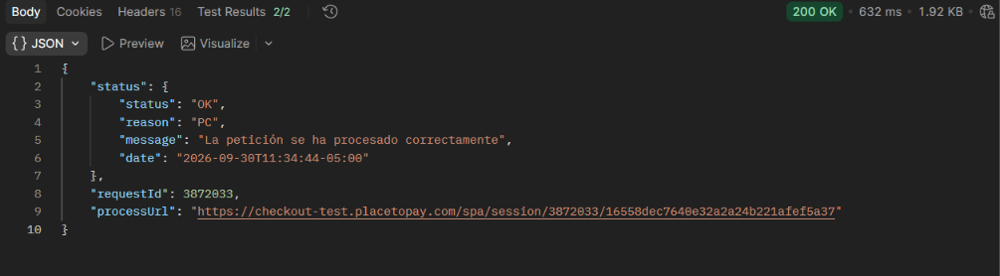
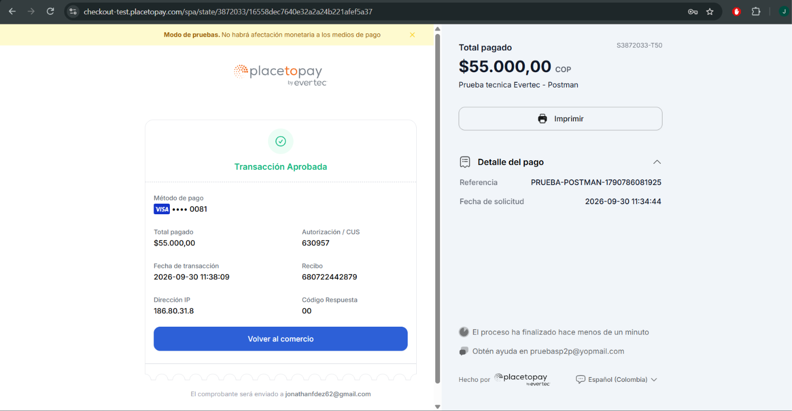
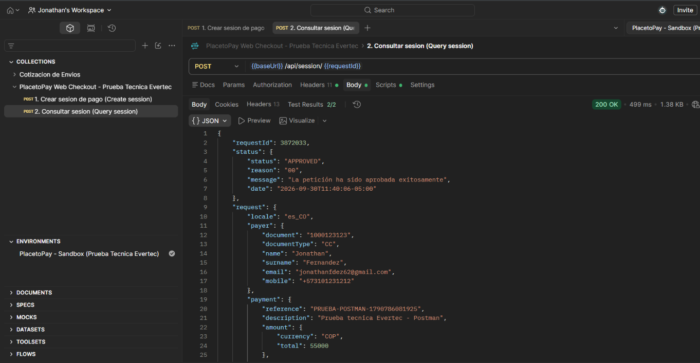
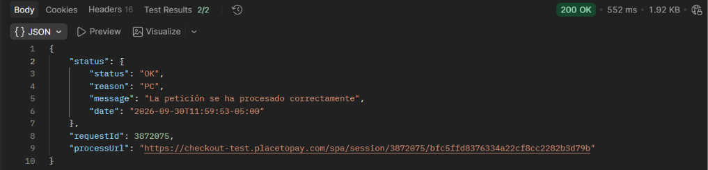
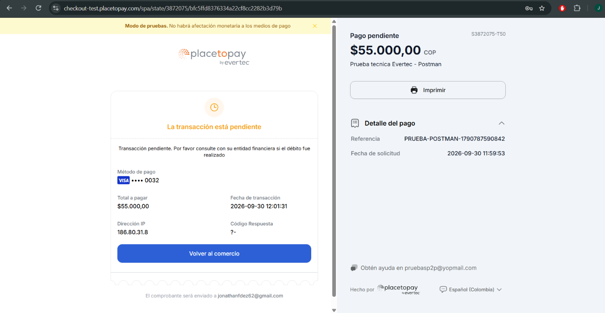
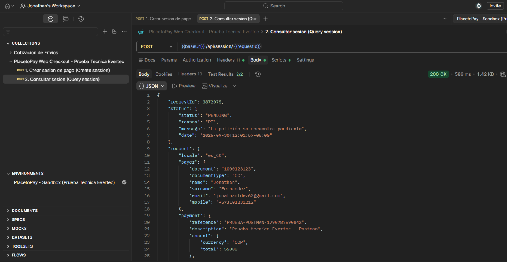
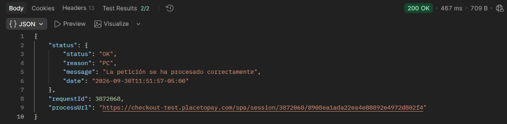
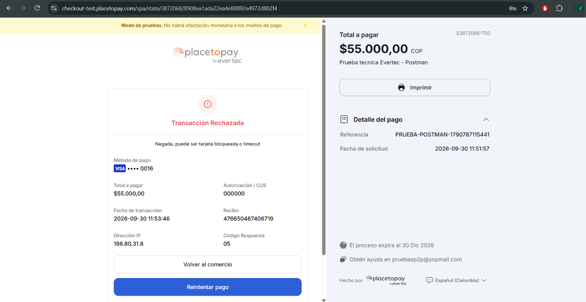
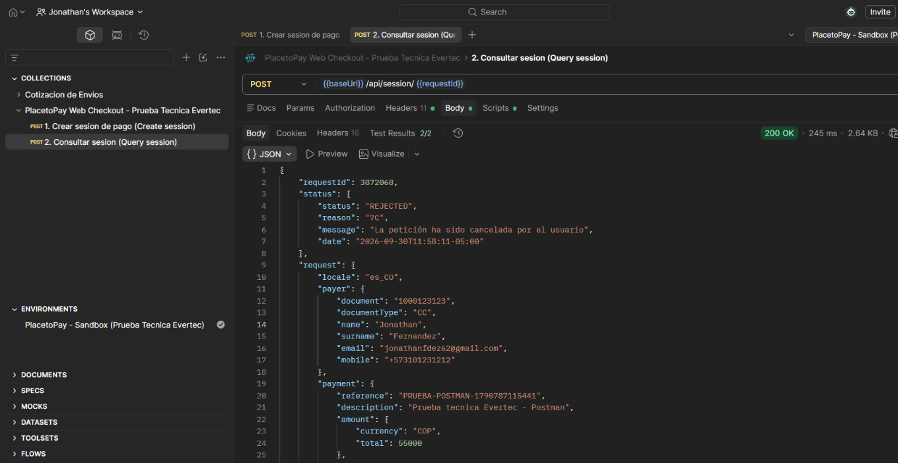

# Punto 1 — Integración con PlacetoPay Web Checkout

## Resumen del resultado

Se integró y probó de **extremo a extremo, contra el ambiente real de
pruebas** (`https://checkout-test.placetopay.com`), usando dos herramientas
distintas (PHP y Postman). Se crearon sesiones de pago reales, se pagaron con
tarjetas de prueba oficiales de PlacetoPay, y se consultó el resultado final
de la API. **Los 3 escenarios pedidos quedaron confirmados con evidencia
real**: `APPROVED`, `PENDING` y `REJECTED`.

| Escenario | requestId | Resultado final |
|---|---|---|
| Aprobado | `3872033` |  `APPROVED` |
| Pendiente | `3872075` |  `PENDING` → luego `APPROVED` |
| Rechazado | `3872068` |  `REJECTED` |

---

## 1. Documentación oficial consultada

Antes de escribir código se revisó la documentación oficial de PlacetoPay:

| Tema | Enlace |
|---|---|
| Cómo funciona Checkout (flujo completo) | https://docs.placetopay.dev/en/checkout/how-checkout-works |
| Autenticación (login / tranKey / nonce / seed) | https://docs.placetopay.dev/checkout/authentication/ |
| Referencia API — Crear sesión | https://docs.placetopay.dev/en/checkout/api/reference/session |
| Tarjetas de prueba (aprobada / pendiente / rechazada) | https://docs.placetopay.dev/en/gateway/testing-card/ |
| Cómo probar tu integración | https://docs.placetopay.dev/en/checkout/test-your-integration |

También se revisó el SDK oficial de PHP de PlacetoPay
([dnetix/redirection](https://github.com/dnetix/redirection)) para confirmar,
con código real, que la consulta de estado es `POST /api/session/{requestId}`
(no `GET`).

## 2. Ambiente y credenciales utilizadas

| Parámetro | Valor |
|---|---|
| Ambiente | Sandbox / pruebas |
| URL base | `https://checkout-test.placetopay.com` |
| Login | `2d9eaf1e662518756a3d78806543af5b` (dato público, viaja en texto plano en cada request) |
| SecretKey | *(no se expone en este documento — se maneja vía variables de entorno / environment de Postman)* |

## 3. Parámetros mínimos para el proceso transaccional

### 3.1 Crear sesión — `POST /api/session`

| Campo | Obligatorio | Descripción |
|---|---|---|
| `auth` | Sí | Bloque de autenticación (login, tranKey, nonce, seed) |
| `ipAddress` | Sí | IP del comprador |
| `userAgent` | Sí | User-Agent del navegador del comprador |
| `returnUrl` | Sí | URL a la que PlacetoPay redirige tras completar el pago |
| `payment.reference` | Sí (para cobrar) | Identificador único de la transacción en el comercio |
| `payment.description` | Sí (para cobrar) | Descripción visible al comprador |
| `payment.amount.currency` | Sí (para cobrar) | Moneda (ISO 4217), ej. `COP` |
| `payment.amount.total` | Sí (para cobrar) | Monto a cobrar |
| `expiration` | No | Vigencia de la sesión (mínimo 5 minutos en el futuro) |
| `locale` | No | Idioma de la página de pago, ej. `es_CO` |

**Respuesta:** `requestId` (identificador de la sesión) y `processUrl` (URL a
la que se redirige al comprador).

### 3.2 Consultar sesión — `POST /api/session/{requestId}`

| Campo | Obligatorio | Descripción |
|---|---|---|
| `auth` | Sí | Bloque de autenticación (se recalcula en cada llamada) |

**Respuesta:** `status.status` con el resultado final:
- `APPROVED` — pago aprobado (estado final)
- `PENDING` — a la espera de confirmación (banco, validación manual, 3DS, etc.)
- `REJECTED` — pago rechazado o sesión cancelada/expirada (estado final)

## 4. Herramientas utilizadas

Se implementó el flujo con **dos herramientas**, tal como lo permite el
enunciado:

1. **PHP 8.5 + cURL nativo** (sin dependencias externas) — carpeta [`src/`](src/)
2. **Postman** (colección + environment) — carpeta [`postman/`](postman/), la
   que se usó para generar toda la evidencia final de este documento

### 4.1 Ejecutar con PHP

```bash
cp .env.example .env
# editar .env con PLACETOPAY_LOGIN y PLACETOPAY_SECRET_KEY

php src/create_session.php aprobada     # o: pendiente | rechazada
# abrir el "processUrl" impreso y pagar con la tarjeta de prueba correspondiente

php src/query_session.php {requestId} aprobada
```

### 4.2 Ejecutar con Postman

1. Importar `postman/PlacetoPay-WebCheckout.postman_collection.json` y
   `postman/PlacetoPay-Sandbox.postman_environment.json`.
2. En el environment, completar `login` y `secretKey` (columna **Current
   Value**) — se dejaron como placeholder a propósito para no versionar
   credenciales reales.
3. Ejecutar **"1. Crear sesión de pago"** → el `requestId` queda guardado
   automáticamente en el environment.
4. Abrir el `processUrl` de la respuesta en el navegador y pagar con una
   tarjeta de prueba.
5. Ejecutar **"2. Consultar sesión"** → devuelve el `status.status` final.

## 5. Estructura del proyecto

```
├── README.md                     Índice general del repositorio
├── SOLUCION_PUNTO_1.md            Este documento (solución completa del punto 1)
├── .env.example                  Plantilla de credenciales
├── src/
│   ├── PlacetoPayClient.php      Cliente HTTP + lógica de autenticación
│   ├── config.php                Carga de variables de entorno
│   ├── create_session.php        CLI: crea una sesión (POST /api/session)
│   └── query_session.php         CLI: consulta una sesión (POST /api/session/{id})
├── postman/
│   ├── PlacetoPay-WebCheckout.postman_collection.json
│   └── PlacetoPay-Sandbox.postman_environment.json
└── evidencias/
    ├── aprobada/
    ├── pendiente/
    └── rechazada/
```

---

## 6. Evidencia del flujo transaccional

Los 3 escenarios se ejecutaron de principio a fin en Postman: **crear
sesión → pagar en la página de PlacetoPay con una tarjeta de prueba →
consultar el resultado**. Todas las capturas y los JSON de respuesta están
en [`evidencias/`](evidencias/); a continuación se muestran incrustadas.

### 6.1 Escenario APROBADO

| Dato | Valor |
|---|---|
| requestId | `3872033` |
| Tarjeta de prueba | `4110760000000081` (Visa) |
| Monto | $55.000 COP |
| Emisor | Banco de Guayaquil, S.A. |
| Autorización | `630957` |
| Código de respuesta | `00` |
| Estado final | **`APPROVED`** — *"La petición ha sido aprobada exitosamente"* |

**1) Crear sesión** (`POST /api/session`)



**2) Pago en el Checkout de PlacetoPay**



**3) Consultar resultado** (`POST /api/session/{requestId}`)



JSON completo: [`evidencias/aprobada/aprobada_consulta_resultado.json`](evidencias/aprobada/aprobada_consulta_resultado.json)

---

### 6.2 Escenario PENDIENTE

| Dato | Valor |
|---|---|
| requestId | `3872075` |
| Tarjeta de prueba | `4110760000000032` (Visa, con challenge 3D Secure) |
| Monto | $55.000 COP |
| Estado inicial | **`PENDING`** — *"La petición se encuentra pendiente"* (reason `PT`) |
| Estado posterior | `APPROVED` (ver nota de ciclo de vida abajo) |

**1) Crear sesión** (`POST /api/session`)



**2) Pago en el Checkout de PlacetoPay** — la tarjeta dispara un challenge 3DS
que deja la transacción **pendiente de confirmación**



**3) Consultar resultado — capturado en el momento exacto en estado `PENDING`**
(`POST /api/session/{requestId}`, 12:01:57)



JSON de ese momento: [`evidencias/pendiente/pendiente_consulta_resultado_PENDING.json`](evidencias/pendiente/pendiente_consulta_resultado_PENDING.json)

---

### 6.3 Escenario RECHAZADO

| Dato | Valor |
|---|---|
| requestId | `3872068` |
| Tarjeta de prueba | `4110760000000016` (Visa — deny) |
| Monto | $55.000 COP |
| Código de respuesta | `05` |
| Estado final | **`REJECTED`** — *"Negada, puede ser tarjeta bloqueada o timeout"* |

**1) Crear sesión** (`POST /api/session`)



**2) Pago en el Checkout de PlacetoPay**



**3) Consultar resultado** (`POST /api/session/{requestId}`)



JSON completo: [`evidencias/rechazada/rechazada_consulta_resultado.json`](evidencias/rechazada/rechazada_consulta_resultado.json)

---

## Tarjetas de prueba oficiales utilizadas

Fuente: https://docs.placetopay.dev/en/gateway/testing-card/

| Tarjeta | Franquicia | Comportamiento |
|---|---|---|
| `4110760000000081` | Visa | Aprueba |
| `4110760000000032` | Visa | Pendiente (3DS challenge) → aprueba |
| `4110760000000016` | Visa | Rechaza (deny) |

---
