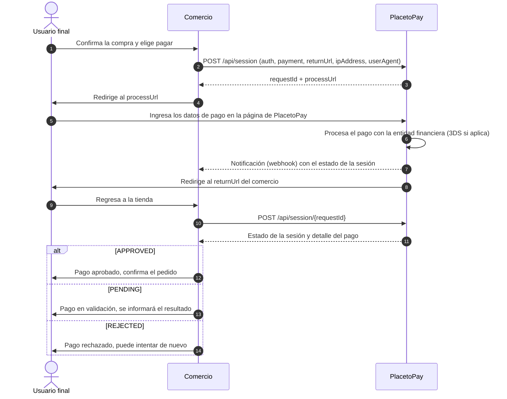
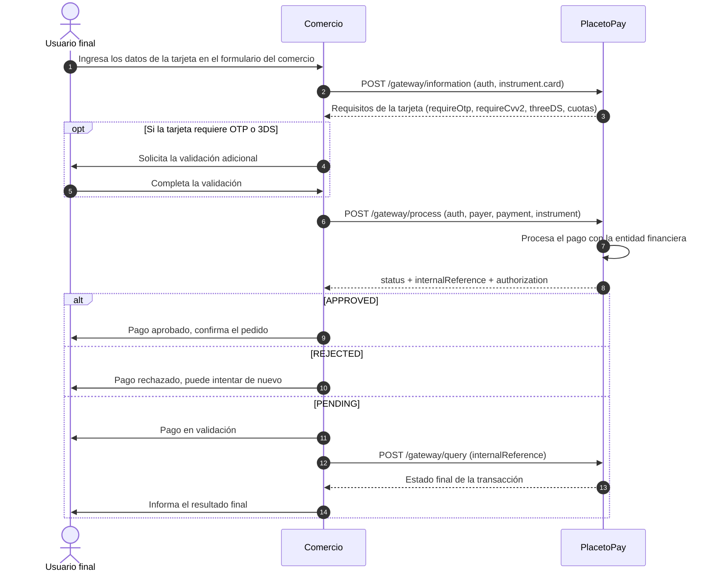

# Punto 4 — Diagrama de flujo del proceso de pago

Flujo de pago entre los tres actores (**Usuario final**, **Comercio** y
**PlacetoPay**) para las dos formas de integración: Web Checkout y API
Gateway.

## Documentación oficial consultada para este punto

| Tema | Enlace |
|---|---|
| Cómo funciona Checkout | https://docs.placetopay.dev/en/checkout/how-checkout-works |
| Notificación (webhook) | https://docs.placetopay.dev/en/checkout/notification |
| API Gateway (cuándo usarlo) | https://docs.placetopay.dev/gateway/ |
| Información de la tarjeta (`/gateway/information`) | https://docs.placetopay.dev/en/checkout/api/reference/gateway-information |
| Referencia API Gateway (`process`, `query`) | https://docs.placetopay.dev/en/gateway/api/reference/transaction/ |

---

## 1. Web Checkout

El comercio crea una sesión y **redirige al usuario a la página de
PlacetoPay**, donde se ingresan los datos de la tarjeta. El comercio nunca
ve esos datos.

**Claves del flujo:**
- Solo hay **2 llamadas** del comercio: crear la sesión y consultarla.
- El `requestId` une todo el flujo: identifica la sesión en la consulta y en
  la notificación.
- La notificación (paso 7) llega aunque el usuario no regrese a la tienda;
  la consulta (paso 10) confirma el estado final.
- Este es el flujo implementado y evidenciado en el
  [Punto 1](SOLUCION_PUNTO_1.md).

---

## 2. API Gateway

El **comercio captura los datos de la tarjeta en su propio formulario** y
los envía directamente a PlacetoPay. No hay redirección: el usuario nunca
sale del sitio del comercio.

**Claves del flujo:**
- El comercio controla toda la experiencia, pero **maneja datos de tarjeta**
  y debe cumplir PCI DSS.
- El comercio debe resolver lo que en Web Checkout hace PlacetoPay:
  formulario de pago, validaciones (OTP/3DS), reintentos y mensajes al
  usuario.
- El identificador de la transacción es el `internalReference`, que se usa
  para consultarla (`/gateway/query`) o para operaciones posteriores como
  reversos y reembolsos (`/gateway/transaction`).

---

## 3. Comparación rápida

| | **Web Checkout** | **API Gateway** |
|---|---|---|
| ¿Dónde ingresa la tarjeta el usuario? | Página de PlacetoPay | Formulario del comercio |
| ¿Hay redirección? | Sí (`processUrl` → `returnUrl`) | No |
| Llamadas principales | `/api/session` y `/api/session/{requestId}` | `/gateway/information`, `/gateway/process` y `/gateway/query` |
| Identificador | `requestId` | `internalReference` |
| Alcance PCI del comercio | Mínimo | Alto |
